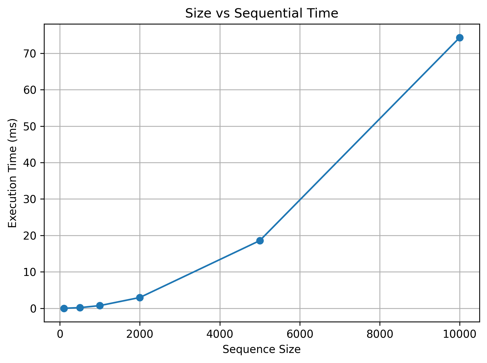
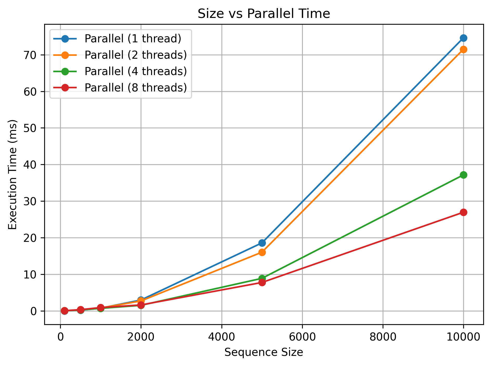
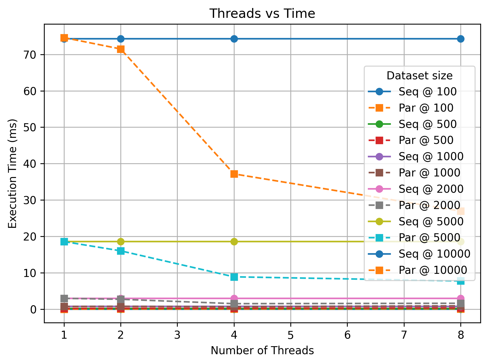
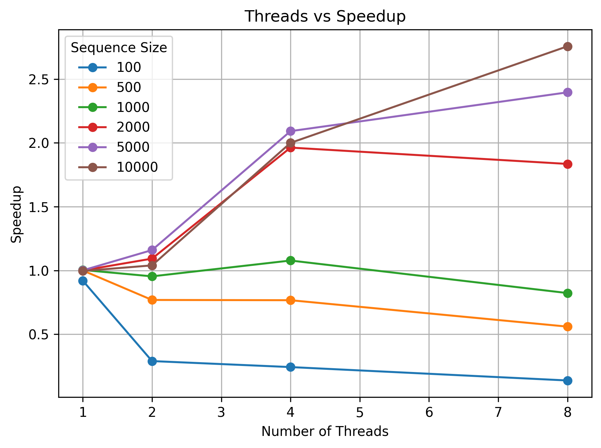
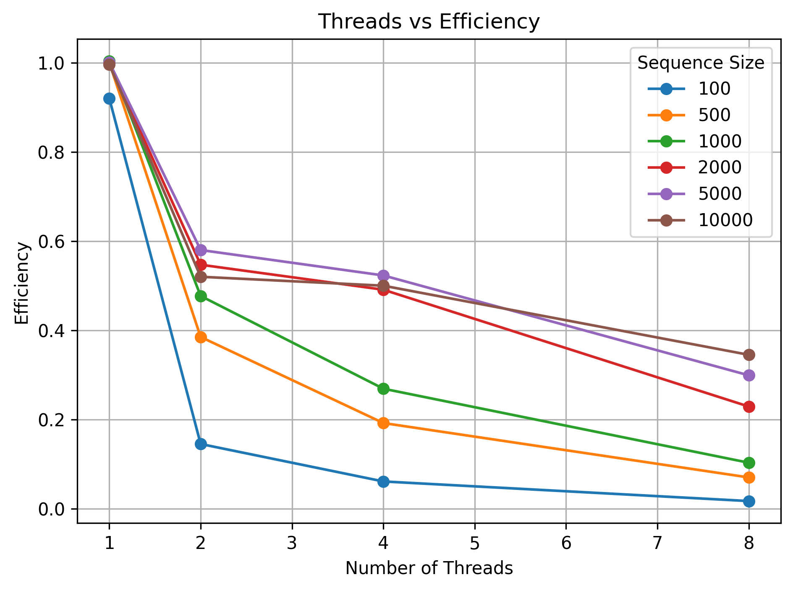

# Needleman-Wunsch Sequence Alignment: C++ Parallel Implementation Report

## 1. Introduction

Needleman-Wunsch is a classic dynamic-programming algorithm for global sequence alignment. It is used to compare two biological sequences by maximizing matches while penalizing mismatches and gaps. In this project, we implemented the algorithm in C++ in both sequential and parallel forms and evaluated them on DNA datasets of increasing size.

The main objective was to preserve correctness while exploiting parallelism across multiple threads. The challenge is that dynamic programming cells depend on neighboring cells, so naive parallelization is not straightforward. A wavefront strategy computes independent cells on the same anti-diagonal in parallel while preserving dependencies across diagonals.

## 2. Problem Definition

Given two DNA sequences, we want to compute the best global alignment score using match = +1, mismatch = -1 and gap = -2.

The core recurrence is:

$$
F_{i,j} = \max(F_{i-1,j-1} + s(a_i, b_j), F_{i-1,j} - 2, F_{i,j-1} - 2)
$$

For the project datasets, the sequence lengths vary from 100 to 10000. The task is to compare:

- a correct sequential implementation
- a parallel implementation using `std::thread`
- measured runtime and speedup across 1, 2, 4 and 8 threads
- correctness of scores for all sizes

## 3. Objectives

1. Implement the sequential baseline correctly.
2. Implement a parallel wavefront algorithm that preserves the same score logic.
3. Verify that the parallel and sequential scores match for all dataset sizes.
4. Benchmark real datasets and explain the observed speedup behavior.
5. Document the project clearly and produce reproducible results from `./run_all.sh`.

## 4. Experimental Setup

The benchmarks were generated from the repository output files in `results/`.

### System configuration

- CPU: Apple M4
- Available cores: 10
- Compiler: Apple LLVM 17.0.0 (clang-1700.6.3.2)
- Compiler flags: `-std=c++17 -O2 -Wall -pthread`
- Timing method: `std::chrono::steady_clock`
- Warm-up: 5 runs per configuration + global warm-up
- Repetitions: 7 timed runs per configuration

### Dataset configuration

The project uses DNA sequences extracted from `ecoli.fasta` and writes paired files under `datasets/`:

- `data_100_A.txt`, `data_100_B.txt`
- `data_500_A.txt`, `data_500_B.txt`
- `data_1000_A.txt`, `data_1000_B.txt`
- `data_2000_A.txt`, `data_2000_B.txt`
- `data_5000_A.txt`, `data_5000_B.txt`
- `data_10000_A.txt`, `data_10000_B.txt`

Sequence A starts at base 0 and sequence B starts at base 500, matching the project specification.

## 5. Results

### Correctness results

The following results were verified by `src/CorrectnessTester.cpp`:

- all six datasets matched exactly between sequential and parallel implementations
- the pass condition held for 1, 2, 4 and 8 threads
- representative values are shown below

| Size | Threads | Sequential | Parallel | Status |
|---:|---:|---:|---:|---|
| 100 | 1 | -31 | -31 | PASS |
| 100 | 2 | -31 | -31 | PASS |
| 100 | 4 | -31 | -31 | PASS |
| 100 | 8 | -31 | -31 | PASS |
| 5000 | 1 | 2500 | 2500 | PASS |
| 5000 | 2 | 2500 | 2500 | PASS |
| 5000 | 4 | 2500 | 2500 | PASS |
| 5000 | 8 | 2500 | 2500 | PASS |
| 10000 | 1 | 7500 | 7500 | PASS |
| 10000 | 2 | 7500 | 7500 | PASS |
| 10000 | 4 | 7500 | 7500 | PASS |
| 10000 | 8 | 7500 | 7500 | PASS |

### Performance results

The measured results in `results/performance.csv` were:

| Size | Threads | Seq (ms) | Par (ms) | Speedup | Efficiency |
|---:|---:|---:|---:|---:|---:|
| 100 | 1 | 0.007 | 0.007 | 0.920 | 0.920 |
| 100 | 2 | 0.007 | 0.023 | 0.290 | 0.145 |
| 100 | 4 | 0.007 | 0.028 | 0.243 | 0.061 |
| 100 | 8 | 0.007 | 0.049 | 0.138 | 0.017 |
| 500 | 1 | 0.185 | 0.185 | 1.000 | 1.000 |
| 500 | 2 | 0.185 | 0.241 | 0.769 | 0.385 |
| 500 | 4 | 0.185 | 0.241 | 0.767 | 0.192 |
| 500 | 8 | 0.185 | 0.331 | 0.560 | 0.070 |
| 1000 | 1 | 0.743 | 0.741 | 1.004 | 1.004 |
| 1000 | 2 | 0.743 | 0.780 | 0.954 | 0.477 |
| 1000 | 4 | 0.743 | 0.690 | 1.078 | 0.269 |
| 1000 | 8 | 0.743 | 0.903 | 0.823 | 0.103 |
| 2000 | 1 | 2.968 | 2.969 | 1.000 | 1.000 |
| 2000 | 2 | 2.968 | 2.715 | 1.093 | 0.547 |
| 2000 | 4 | 2.968 | 1.512 | 1.963 | 0.491 |
| 2000 | 8 | 2.968 | 1.617 | 1.835 | 0.229 |
| 5000 | 1 | 18.586 | 18.575 | 1.001 | 1.001 |
| 5000 | 2 | 18.586 | 16.029 | 1.160 | 0.580 |
| 5000 | 4 | 18.586 | 8.886 | 2.092 | 0.523 |
| 5000 | 8 | 18.586 | 7.757 | 2.396 | 0.299 |
| 10000 | 1 | 74.333 | 74.628 | 0.996 | 0.996 |
| 10000 | 2 | 74.333 | 71.507 | 1.040 | 0.520 |
| 10000 | 4 | 74.333 | 37.168 | 2.000 | 0.500 |
| 10000 | 8 | 74.333 | 26.958 | 2.757 | 0.345 |

The best speedup observed is 2.757x at size 10000 with 8 threads.

### Embedded graphs

#### Size vs sequential time

#### Size vs parallel time

#### Threads vs time

#### Speedup graph

#### Efficiency graph

## 6. Why speedup is not linear

The measured speedup is below ideal linear scaling, and this matches the structure of the algorithm and the hardware.

### 6.1 Thread overhead

Even when each thread does useful work, creating and managing worker threads adds overhead. For short inputs, this overhead dominates the whole runtime. For example:

- size 100 at 8 threads: sequential = 0.007 ms, parallel = 0.049 ms, speedup = 0.138
- size 500 at 8 threads: sequential = 0.185 ms, parallel = 0.331 ms, speedup = 0.560

These are not real scaling wins; they are cases where overhead is larger than the amount of work.

### 6.2 Barrier cost and synchronization

The wavefront algorithm must wait for one diagonal tile set to finish before proceeding to the next. This introduces synchronization points, especially when the frontier contains short diagonals or a small number of cells. As a result, the parallel runtime is influenced by the latency of barrier coordination as much as by arithmetic work.

### 6.3 Short corner diagonals

Cells near the start or end of the matrix are few in number. These edge diagonals create under-utilized work units. A few threads may be active for a short period, then all wait at the next barrier. This reduces efficiency at small sizes and in the early/late phases of large matrices.

### 6.4 Memory and cache behavior

The sequential row-wise DP loop is cache-friendly. The tiled wavefront accesses cells in a pattern that is more complex and less contiguous. This means that even when the algorithm is parallelized, memory traffic and cache misses reduce the effective gain. The row-based loop remains the best single-thread path.

### 6.5 Amdahl's law

Amdahl's law states that overall speedup is bounded by the fraction of work that remains serial:

$$
S = \frac{1}{(1 - P) + P/N}
$$

where $P$ is the parallelizable fraction and $N$ is the number of threads. In this project, not all work can be parallelized efficiently because of:

- synchronization between tiles
- idle threads on short diagonals
- memory-bound behavior
- the need to maintain a shared DP frontier

This explains why the observed speedup grows with problem size but remains below linear, even on a 10-core machine.

## 7. Bottlenecks

The parallelization bottlenecks are:

1. Synchronization between tile waves.
2. Thread pool overhead for small inputs.
3. Reduced efficiency at short diagonals and matrix corners.
4. Memory/cache effects from wavefront traversal.
5. The sequential path remains a strong baseline for medium and small datasets.

The best-performing case is not the smallest input but the largest one, where the cost of synchronization is amortized over more computation. This is visible in the numbers: size 10000 with 8 threads gives 2.757x speedup, while size 100 with 8 threads gives 0.138x.

## 8. Conclusion

The project successfully demonstrates an exact C++ implementation of Needleman-Wunsch alignment with a parallel wavefront optimization. The sequential and parallel scores match for every dataset pair and every tested thread count, so correctness is preserved.

The measured speedup is not ideal because of communication, synchronization, small-input overhead and memory behavior, but the design is valid and improves as the problem size grows. The largest benchmark, size 10000 at 8 threads, produced the best result with a speedup of 2.757x.

Overall, the project meets its objectives: correct alignment scores, reproducible benchmarking, and a clear explanation of why the parallel speedup is bounded by real system overhead rather than by algorithmic error.
